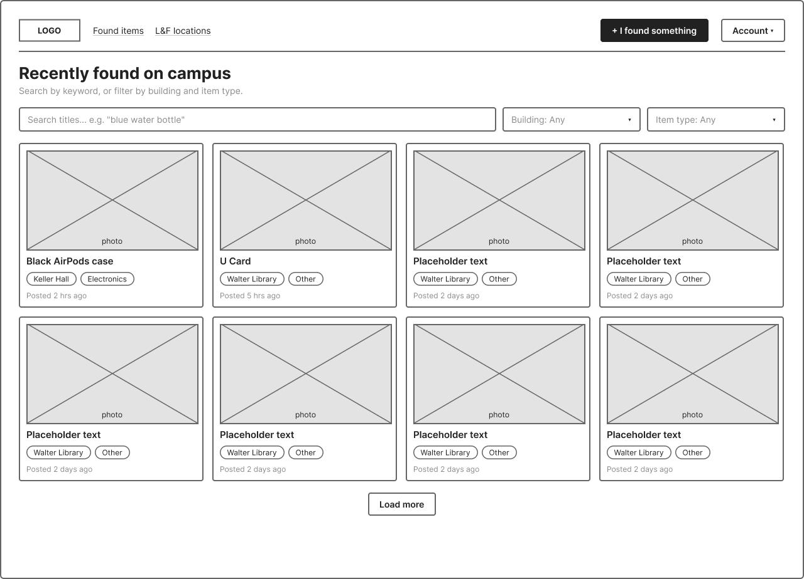
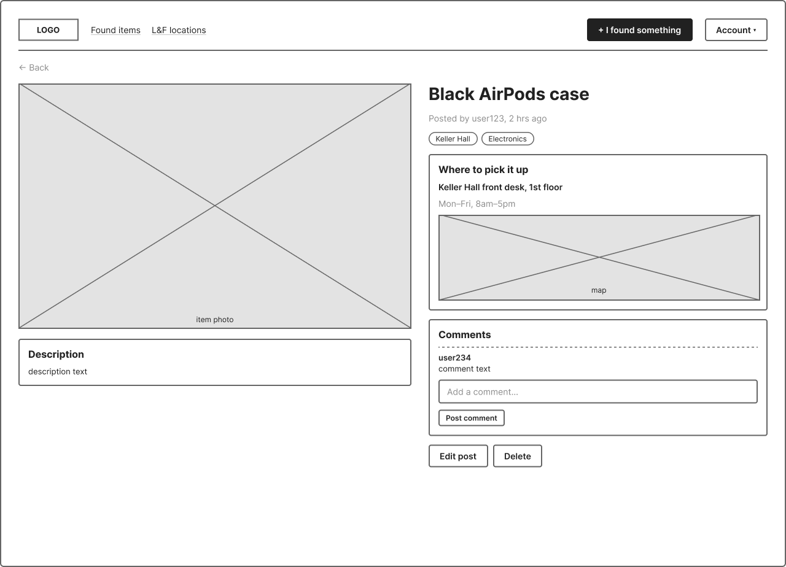
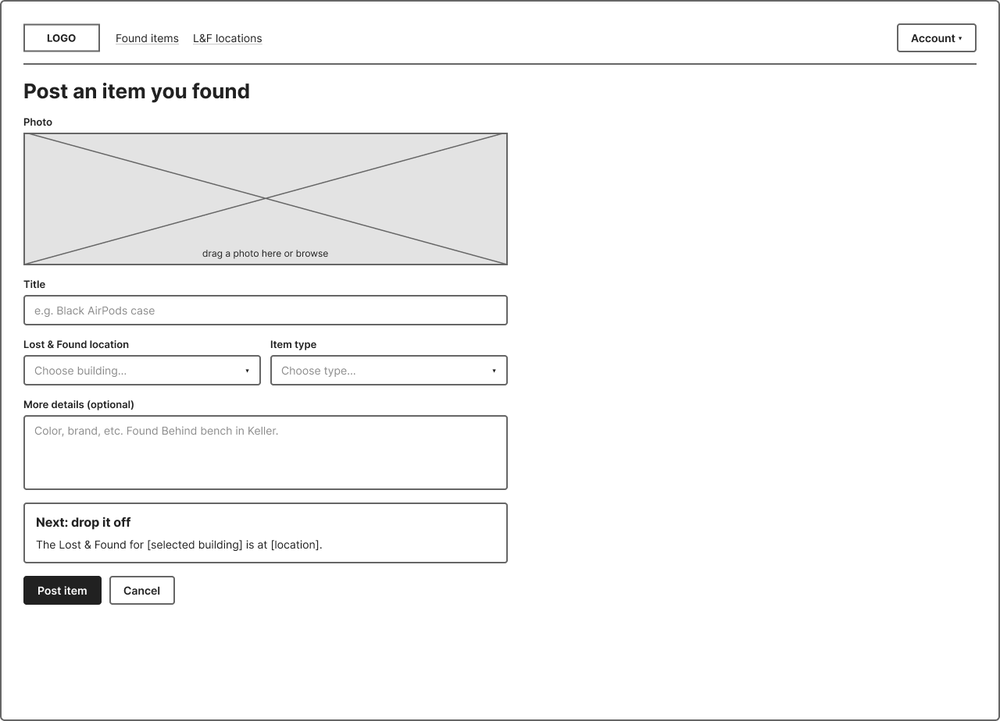
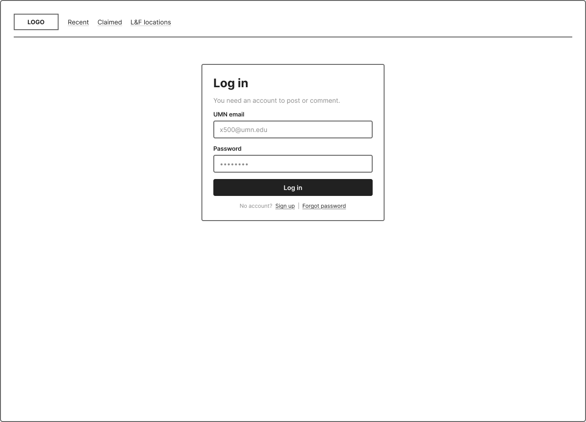
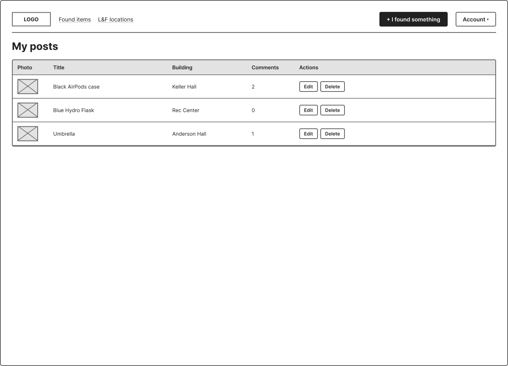

# Module 1 Group Assignment

CSCI 5117, Fall 2026, [assignment description](https://canvas.umn.edu/courses/579310/pages/project-1)

## App Info:

* Team Name: Yarakani
* App Name: TODO
* App Link: <https://TODO.com/>

### Students

* Nipun Bhatnagar, bhatn058@umn.edu
* Yassir Abdalla, abdal167@umn.edu
* Ray Amberg, amber079@umn.edu
* Kane Stirling stirl027@umn.edu
* Blake Gabriel gabri354@umn.edu

## Key Features

**Describe the most challenging features you implemented
(one sentence per bullet, maximum 4 bullets):**

* ...

## Testing Notes

**Is there anything special we need to know in order to effectively test your app? (optional):**

* ...

## Screenshots of Site

**[Add a screenshot of each key page (around 4)](https://stackoverflow.com/questions/10189356/how-to-add-screenshot-to-readmes-in-github-repository)
along with a very brief caption:**

## Mock-up 

There are a few tools for mock-ups. Paper prototypes (low-tech, but effective and cheap), Digital picture edition software (gimp / photoshop / etc.), or dedicated tools like moqups.com (I'm calling out moqups here in particular since it seems to strike the best balance between "easy-to-use" and "wants your money" -- the free teir isn't perfect, but it should be sufficient for our needs with a little "creative layout" to get around the page-limit)

In this space please either provide images (around 4) showing your prototypes, OR, a link to an online hosted mock-up tool like moqups.com

**[Add images/photos that show your paper prototype (around 4)](https://stackoverflow.com/questions/10189356/how-to-add-screenshot-to-readmes-in-github-repository) along with a very brief caption:**

### 1. Home feed

*Main page most users will experience. Displays recently found items with filters for specific building and item types*

### 2. Item page

*Detail view for a single found item: photo, description, where to pick it up with a map image, and a comment section Edit and delet buttons only appear when the user is the original creator of the post*

### 3. Post found item

*Form for creating a post including a generated textboc at the bottom prompting the user to drop off the item*

### 4. Log in

*Sign-in page restricted to umn email*

### 5. My posts

*A user's own posted items in a table, with comment counts and edit/delete actions for each one.*

## External Dependencies

**Document integrations with 3rd Party code or services here.
Please do not document required libraries. or libraries that are mentioned in the product requirements**

* Library or service name: description of use
* ...

**If there's anything else you would like to disclose about how your project
relied on external code, expertise, or anything else, please disclose that
here:**

...
